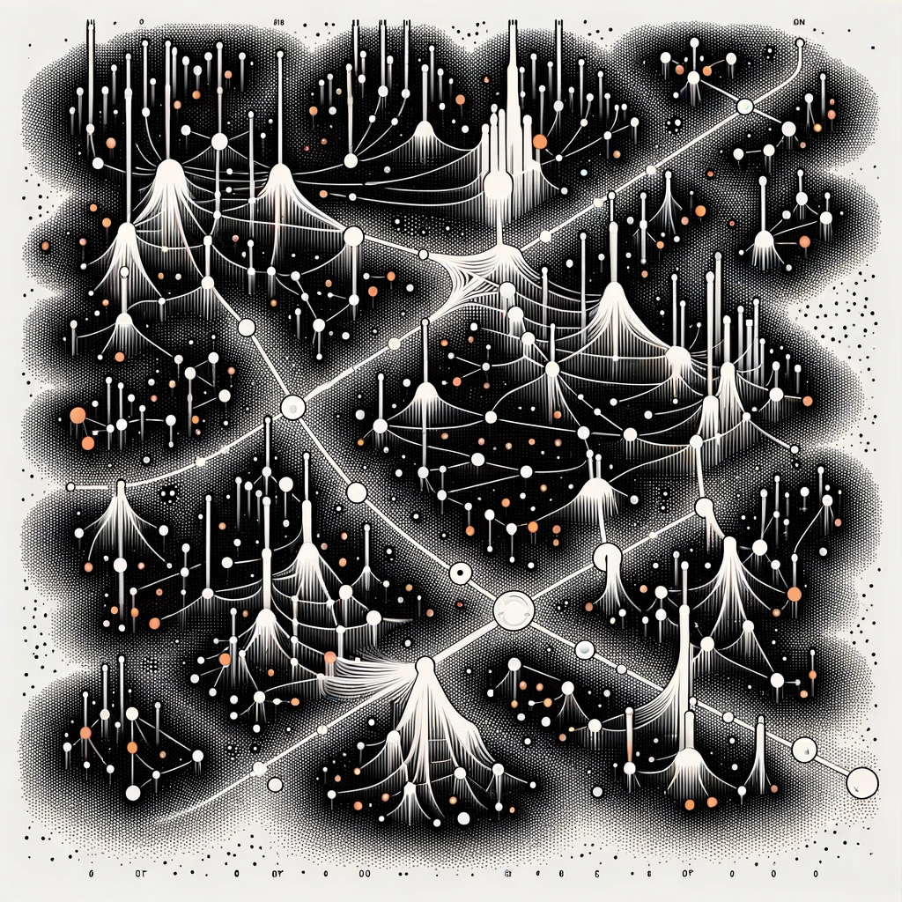

# Quarterly S&P 500 Return Probabilities: A Hierarchical Bayesian Approach



## Overview

This notebook uses **PyMC 5.10** and **ArviZ** to estimate the probability that
quarterly S&P 500 returns will fall within four buckets:

| Bucket | Log-return range | Approx. simple return |
|---|---|---|
| Strong positive | > +5% | > +5.1% |
| Mild positive | 0% to +5% | 0% to +5.1% |
| Mild negative | −5% to 0% | −4.9% to 0% |
| Strong negative | < −5% | < −4.9% |

The **Hierarchical Bayesian Model** is the primary forecasting model. It uses a
three-level partial-pooling structure with yield-curve-based market regimes,
regime-specific coefficients, and regime-specific tail/scale parameters.

A **Flat Bayesian Linear Regression** (single parameter set, Student-t
likelihood) is retained solely as a benchmark. The hierarchical structure earns
its complexity on calibration metrics (Brier Score, Log Score) but **not** on
raw top-bucket accuracy — the flat model hits 45% vs the hierarchical model's
41%. The hierarchy's genuine edge is in the Recessionary regime (BSS 0.134) and
in better-calibrated probabilities when the model is uncertain.

Both are evaluated on an **out-of-sample walk-forward test of 22 quarters
(2020 Q4 – 2026 Q1)**, spanning the COVID crash, the 2022 bear market, the
2023–2024 recovery, and the 2025–2026 period.

---

## Modeling Assumptions

Every modeling decision is deliberate. This section documents what was chosen,
what was rejected, and why.

### 1. Log returns, not simple returns

We model log returns `ln(P_t / P_{t-1})` rather than simple percentage returns.

- Log returns are time-additive: a multi-period log return is the sum of
  single-period log returns.
- They produce a more symmetric distribution, which is easier to model.
- Converting back to simple returns for interpretation is straightforward:
  `simple_return = exp(log_return) − 1`.

### 2. Monthly data, quarterly forecasts

FRED data is ingested at **monthly** frequency and walked forward one month at
a time. Every three consecutive monthly predictions are compounded into a
quarterly return distribution, which is what the bucket probabilities and
evaluation metrics are computed on. The rationale:

- Monthly ingestion captures faster-moving signals (credit spreads, yield
  changes) without forcing coarse quarterly averages.
- Quarterly aggregation retains the natural horizon for institutional
  reporting and portfolio rebalancing.
- Compounding monthly distributions preserves the full predictive uncertainty
  across the three months rather than collapsing it to a point estimate.

With data pulled from FRED starting Q1 1997, usable observations begin around
Q1 1999 (~312 monthly observations through 2024) — reasonable for Bayesian
estimation with enough recessionary and transitional months to data-identify
regime-specific parameters.

### 3. Features — lagged by one period

Six features, all lagged one period so they are fully known at prediction time.
Yield curve, HY spread, and CPI are sourced from FRED (`T10Y2Y`,
`BAMLH0A0HYM2`, `CPIAUCSL`).

| Feature | Transformation | Rationale |
|---|---|---|
| `yield_curve_lag1` | Previous month-end 10Y–2Y spread (raw level) | Forward-looking macro regime signal; inverted curve precedes recessions |
| `yield_curve_chg_lag1` | Month-over-month change in 10Y–2Y spread | Momentum in yield curve steepening / flattening |
| `hy_spread_lag1` | Previous month-end HY OAS level | Credit-risk appetite signal; widens ahead of equity drawdowns |
| `hy_spread_chg_lag1` | Month-over-month log change in HY OAS | Spread momentum — rapidly widening spreads signal risk-off |
| `mom_12_1` | 12-1 price momentum: log(P_{t-1}/P_{t-12}) | Medium-horizon trend signal; avoids one-month reversal noise of raw lag |
| `real_yield_lag1` | 10Y Treasury minus CPI YoY | Captures inflation-driven discount-rate shocks invisible to slope alone |

Lagging is a strict requirement: using same-period features would constitute
look-ahead bias and overstate out-of-sample accuracy.

### 4. Student-t likelihood — not Normal

Financial returns have **fat tails**. Black Monday 1987 (Dow −22.6% in one day)
is a ~20-sigma event under normality — a probability so small it should never
have occurred in the history of the universe. It happened. Goldman Sachs's risk
team famously observed "25-sigma events, several days in a row" in August 2007.

The **Student-t distribution** with degrees of freedom `nu` accommodates this:
lower `nu` → heavier tails → more probability mass on extreme events. This is
the statistically correct model for equity returns.

### 5. Degrees-of-freedom prior — floor at nu = 4

The prior on `nu` is:

```
nu ~ Exponential(lam=1/20) + 4
```

The **floor at 4** is a deliberate modeling constraint. Here is the rationale:

| nu range | Consequence | Assessment |
|---|---|---|
| nu < 2 | Infinite variance | Statistically pathological; rejected |
| 2 ≤ nu < 4 | Infinite kurtosis | Implies extreme events every few quarters — too aggressive even for financial markets |
| 4 ≤ nu ≤ 15 | Finite variance and kurtosis, heavy tails | Consistent with empirical estimates for quarterly equity returns |
| nu > 30 | Approaches Normal distribution | Appropriate for calm regimes |

The tension we are resolving: black swans are real and happen more often than
the Normal distribution implies — but they still should not happen *every few
quarters*. The floor at 4 encodes that constraint while keeping the tails
genuinely heavy. The Exponential shift puts the bulk of the prior in the
[4, 30] range, consistent with empirical estimates in the financial
econometrics literature.

In the hierarchical model, `nu` is **regime-specific** — the recessionary
regime is expected to learn a lower `nu` (heavier tails) than the expansionary
regime, capturing the empirical finding that tail risk is not constant across
market environments.

### 6. Prior on regression coefficients — weakly informative

```
alpha, beta_* ~ Normal(0, sigma=0.05)
```

Features are RobustScaler-standardized (centered at median, scaled by IQR),
so a coefficient of 0.05 corresponds to a 5% change in log return per IQR
of the feature — a reasonable upper bound on macro predictability. The prior
is wide enough for the data to dominate the posterior without being so diffuse
that it contributes no regularisation at all.

If the posterior credible intervals exclude zero for a coefficient, the data
found a signal. If not, the features simply have limited predictive power at
monthly/quarterly frequency — which is itself a finding worth reporting.

### 7. Observation scale prior

```
sigma ~ HalfNormal(sigma=0.05)    # flat model
sigma_h ~ HalfNormal(sigma=0.04, shape=n_regimes)  # hierarchical, per-regime
```

HalfNormal places most mass near small positive values. The scale parameter
is calibrated to observed **monthly** S&P 500 log-return volatility
(historically ~3–4%). In the hierarchical model, each regime has its own
`sigma_h`: the recessionary regime is expected to learn a larger scale,
capturing **volatility clustering** — the well-documented empirical pattern
that high-volatility periods cluster together.

### 8. Yield-curve regime classifier

The hierarchical model classifies each month into one of three regimes using
the **previous month's 10Y–2Y Treasury yield spread** — fully known at the
start of each month (no look-ahead bias):

| Regime | Lagged yield curve slope | Market environment |
|---|---|---|
| 0 — Recessionary | < 0% (inverted) | Curve has inverted; elevated recession risk |
| 1 — Transitional | 0% to 1% (flat) | Late-cycle or early recovery |
| 2 — Expansionary | ≥ 1% (steep) | Normal growth environment |

**Why yield curve slope?** The 10Y–2Y spread has inverted before every US
recession since 1955 and does so *before* the downturn begins — making it a
genuinely forward-looking signal. By contrast, VIX and credit spreads tend to
react *during* crises rather than anticipate them. The yield curve is the
single most informative public macro signal for near-term recession risk.

**No test-set contamination**: regime boundaries (0% and 1%) are economically
motivated thresholds, not data-fitted. The test period (2020–2026) is never
consulted during regime design.

**Known limitation**: these are static hard-coded thresholds. A data-driven
approach would learn regime boundaries jointly from the data. See
[Priority 3](#priority-3--replace-static-regime-boundaries-with-dynamic-assignment) in the roadmap.

### 9. Partial pooling (hierarchical model)

The hierarchical model sits between two extremes:

| Approach | Description | Problem |
|---|---|---|
| Complete pooling | One parameter set for all regimes | Ignores regime differences |
| No pooling | Separate model per regime | Too little data per regime |
| **Partial pooling** | Regime params drawn from shared hyperpriors | Borrows strength across regimes |

Regime-level coefficients are drawn from global hyperpriors:

```
alpha_r[k] = mu_alpha + alpha_offset[k] * sigma_alpha
```

`sigma_alpha` controls the degree of pooling: if its posterior is small, the
regimes are similar and share a common intercept; if large, each regime has a
distinct intercept. This is *learned from data*, not assumed.

### 10. Non-centered parameterization

Regime parameters use the non-centered form above rather than the centered form
`alpha_r[k] ~ Normal(mu_alpha, sigma_alpha)`. When `sigma_alpha` is near zero,
the centered form creates a geometry ("Neal's funnel") that causes NUTS to
diverge or mix poorly. The non-centered form decouples the offset from the
scale and allows efficient sampling throughout the posterior.

### 11. Prior predictive checks

Before touching observed data, we verify that the priors generate plausible
quarterly return distributions. The plot uses `xlim=±50%` for readability and
separately reports the fraction of draws that fall outside this window — so
the full distribution is visible and quantified, not hidden.

### 12. Empirical CDF for probabilities

Predicted probabilities for each bucket are computed directly from the
posterior predictive samples:

```python
prob_above_5 = np.mean(post_samples > 0.05)
```

The posterior predictive is a **mixture** of Student-t distributions — one per
posterior draw of the parameters. Computing probabilities from the sample
empirical CDF is exact and makes no distributional assumptions about the shape
of the mixture.

### 13. Walk-forward expanding-window validation

The model is evaluated using a strict expanding-window walk-forward approach:

1. Train on all monthly data up to period *t* only.
2. Refit the RobustScaler on the current training window — prevents future-data
   leakage into the scaling transformation.
3. Sample the posterior on training data.
4. Set features to the test month *t+1* and sample posterior predictive.
5. After every 3 months, compound the monthly distributions into a quarterly
   return distribution and compute bucket probabilities.
6. Add month *t+1* to the training set and repeat.

**Train/test split: `train_end_year = 2018`** (~240 training months,
test period beginning January 2019). The first complete quarterly prediction
is available at **2020 Q4** due to data availability constraints on the
`real_yield_lag1` feature (CPI YoY lag). This yields **22 test quarters
(2020 Q4 – 2026 Q1)**.

The split year was chosen to ensure each regime has enough training observations
for meaningful partial pooling while leaving a demanding test period. Cutting at
2018 includes the 2008–2009 GFC, the 2011 European debt crisis, and the 2018 Q4
volatility spike in the training set. The test period then covers the
COVID crash (2020 Q4 environment), the low-volatility 2021 bull run, the 2022
inflation-driven bear market, the 2023–2024 recovery, and 2025–2026 — a genuine
stress test spanning all three yield-curve regimes.

---

## Out-of-Sample Accuracy

Both models are evaluated on **22 quarters (2020 Q4 – 2026 Q1)** that were
never seen during training. Three complementary metrics are computed in
**cells 33–35**.

---

### Metric 1 — Top-Bucket Accuracy (cells 21 and 31)

Each quarter the model assigns a probability to four possible outcomes:

| Bucket | Meaning |
|---|---|
| Strong positive | S&P 500 returns more than +5% that quarter |
| Mildly positive | Returns between 0% and +5% |
| Mildly negative | Returns between −5% and 0% |
| Significant drop | Returns worse than −5% |

The model is **correct** if the bucket it was most confident about actually
happened. Random guessing hits 25% (1 in 4). See cells 21 and 31 for the
actual numbers.

---

### Metric 2 — Brier Score (cell 34)

Measures how far the predicted probabilities are from the true outcome,
across all four buckets at once. Think of it as an "average squared miss."

- **0 = perfect** — every probability was spot-on
- **0.75 = random** — what you'd score by guessing 25% for every bucket

Lower is better. The **Brier Skill Score (BSS)** rescales this so that
0 = no better than random and 1 = perfect. A positive BSS means the model
adds real forecasting value beyond a coin flip. See **cell 34** for the
computed values for both models.

> *Plain English: a model that confidently called the 2020 COVID drop correctly
> would earn a very low (good) Brier Score for that quarter. A model that was
> 80% confident in the wrong bucket would be heavily penalised.*

---

### Metric 3 — Log Score (cell 34)

Also called the logarithmic scoring rule. It rewards genuine, well-placed
confidence and **severely penalises overconfident wrong predictions**.

- **Random baseline ≈ 1.39** — what you'd score guessing 25% every time
- **Perfect = 0**
- Lower is better

Observed values across the test period (22 quarters):

| Metric | Flat model | Hierarchical model |
|---|---|---|
| Top-bucket accuracy | **45%** | 41% |
| Brier Score | 0.7225 | **0.7162** |
| Brier Skill Score | 0.0366 | **0.0450** |
| Log Score | 1.3330 | **1.2981** |

The flat model wins on raw classification accuracy (45% vs 41%), while the
hierarchical model wins on probability calibration (Brier, Log Score). This
is a meaningful distinction: the flat model is more often *directionally*
correct, but the hierarchical model is better at *sizing its uncertainty* — it
assigns more appropriate probabilities rather than being overconfident.

> *Plain English: if the model says "90% chance of a strong quarter" and it
> crashes instead, the Log Score punishes that far harder than the Brier Score
> does. A low Log Score means the model is both right and honest about its
> uncertainty.*

---

### Regime-Stratified Table and Calibration Diagram (cell 35)

The regime-stratified breakdown shows accuracy and Brier Score separately for
Recessionary, Transitional, and Expansionary quarters.

Observed results for the hierarchical model (22-quarter test, 2020–2026):

| Regime | N quarters | Accuracy | Brier Score | BSS |
|---|---|---|---|---|
| Recessionary (<0%) | 8 | **50%** | **0.6494** | **0.1342** |
| Transitional (0–1%) | 11 | 27% | 0.7704 | −0.0272 |
| Expansionary (≥1%) | 3 | 67% | 0.6960 | 0.0720 |

Two key findings:

1. **Recessionary regime: genuine edge.** BSS of 0.134 is the model's strongest
   result. Regime-specific tail and scale parameters allow it to assign more
   probability mass to extreme outcomes when the yield curve is inverted.

2. **Transitional regime: worse than random.** BSS of −0.027 means the
   hierarchical model in Transitional quarters is *worse* than just guessing
   25% for each bucket. This is the most important diagnostic: with 11 of 22
   test quarters in this regime, improving Transitional performance is the
   single highest-leverage improvement available. See
   [Priority 3](#priority-3--replace-static-regime-boundaries-with-dynamic-assignment).

---

### Walk-Forward Design (no data leakage)

At every step the model only knows what was available *at the time of the
forecast*: training data, feature scaling, and regime boundaries are all
computed using only past months. No future information ever leaks in.

### Caching — backtest and trace

The walk-forward loop resamples MCMC for every test month, which is
computationally intensive. Results are cached to disk automatically:

- **`backtest_results_flat_YYYYMMDD.csv`** — flat model walk-forward
  predictions, keyed by the last test date. If the file exists, the cell
  skips the MCMC loop entirely.
- **`backtest_results_monthly_YYYYMMDD.csv`** — hierarchical model
  walk-forward predictions and probabilities, keyed by the last date in
  FRED data. If the file exists, the cell skips the MCMC loop entirely.
- **`trace_full_monthly_YYYYMMDD.nc`** — the full-data posterior trace used
  for forecasting, also keyed by last data date. The forecast cell loads it
  instantly on subsequent runs instead of resampling.

All caches invalidate automatically when new FRED data arrives (the date in
the filename changes), so reruns after a data refresh always retrain from
scratch. Old cache files with stale dates can be deleted manually to free
disk space.

---

## Decision-Making Performance Dashboard (cell 36)

After the backtest, cell 36 produces a two-panel dashboard that answers the
practical question: *at what confidence threshold should I act on the model's
top-bucket call?*

- **Panel 1 — Per-quarter confidence bars**: each of the 22 test quarters is
  shown as a bar coloured green (model's top bucket was correct) or red
  (wrong), with height proportional to the model's confidence in that call.
- **Panel 2 — Hit rate vs confidence threshold**: a table and chart showing
  how accuracy changes as you raise the bar for acting on a forecast.

The dashboard is saved as **`backtest_dashboard.png`**.

---

## Practical Assessment (walk-forward backtest, 2020 Q4 – 2026 Q1)

### Overall accuracy

| Metric | Value |
|---|---|
| Quarters evaluated | 22 |
| Hierarchical top-bucket correct | 9 (41%) |
| Flat top-bucket correct | 10 (45%) |
| Random baseline | 25% |
| Hierarchical edge over random | +16pp |

Both models outperform random guessing. The flat model has higher raw accuracy;
the hierarchical model has better-calibrated probabilities.

### The confidence threshold insight

The backtest dashboard (bottom panel) shows how hit rate changes with the
model's confidence in its top-bucket call:

| Confidence ≥ | Hit rate | # Signals | Coverage |
|---|---|---|---|
| 25% (all quarters) | 41% | 22 | 100% |
| 30% | 41% | 22 | 100% |
| 35% | 41% | 17 | 77% |
| 40% | 22% | 9 | 41% |
| 45% | 0% | 1 | 5% |

**The confidence threshold does not improve accuracy here.** Unlike earlier
model versions, filtering to high-confidence quarters hurts rather than helps —
the model's confident calls in this test window were often wrong. This is the
clearest signal that the current regime design and feature set need improvement
before the model can be used as an actionable signal.

### The 2022 failure — structural, not random

All four quarters of 2022 were wrong. The root cause: the inflation-driven
bear market was unlike anything in the 1999–2018 training set. The yield curve
was steepening rapidly *while* equities fell — a decoupling of the slope regime
from equity returns that `yield_curve_lag1` alone cannot detect.

Adding `real_yield_lag1` (10Y − CPI YoY) was a direct response to this: real
yields swung from **−6% to +1%** in twelve months while the nominal slope stayed
positive. The feature is now in the model, but the 2022 quarters remain
in-sample for evaluation; the full benefit of this addition will show in future
test periods.

### What this means for use

This model is best used as **one probabilistic input** in a broader decision
process, not as an autonomous signal. At its current development stage:

- **Do not act on high-confidence calls alone.** The threshold table shows
  accuracy falls at higher confidence levels in the current test window.
- **The Recessionary regime is the strongest signal.** BSS 0.134 in inverted-
  curve environments suggests genuine regime awareness when the macro signal is
  sharpest.
- **Wide credible intervals are information, not failure.** A 90% CI of
  −18% to +23% means current macro conditions are genuinely ambiguous —
  the model is being honest rather than manufacturing a false point estimate.
- **The Transitional regime (0–1% slope) is currently unreliable.** With
  BSS = −0.027, the model's probabilistic estimates in this regime are worse
  than random and should not be used without further improvement.

---

## Next-Quarter Forecast (cells 37–40)

After evaluation, the model retrains on **all available data** and uses the
most recent month's macro readings to forecast the next quarter.

**What the forecast outputs:**

- **Regime** — which yield-curve environment next quarter falls into
  (Recessionary / Transitional / Expansionary), based on the current
  10Y–2Y Treasury spread
- **Bucket probabilities** — the probability of each of the four return
  outcomes (compounded from monthly predictions)
- **Expected return** — the probability-weighted average forecast
- **Credible intervals** — 50% CI and 90% CI
- **Probability bar chart** — visual summary with the 25% random baseline

> *Plain English: the forecast does not say "the market will go up X%." It
> says "given current macro conditions, here is how probable each outcome is."
> A wide credible interval means genuine uncertainty — the model is being
> honest rather than hiding behind a false point estimate.*

### Print-Ready Forecast Report (cell 40)

Cell 40 generates a single-page briefing figure saved as
**`forecast_YYYYQ#.png`** — one file per quarter, auto-named, archivable.
It contains everything needed for a quarterly decision briefing:

| Section | Content |
|---|---|
| Header | Quarter label and colour-coded regime banner |
| Probability bars | Four return buckets with the top bucket highlighted |
| Macro inputs table | The six lag-1 features that drove the forecast |
| Return distribution strip | Posterior 90%/50% CI and expected return |
| Backtest context line | Overall accuracy and hit rate at the current confidence level |

---

## Improvement Roadmap

Prioritised by expected impact on the two diagnosed failure modes
(Transitional regime worse than random + high-confidence calls not improving accuracy).

### Priority 1 — Replace static regime boundaries with dynamic assignment

This is the most structurally important improvement. The current hard thresholds
(0% and 1%) are economically motivated but fixed — they treat every 0.01%
yield-curve reading the same regardless of context, and they assign the same
Transitional label to late-cycle tightening and early-cycle recovery, which have
opposite equity implications.

Options in increasing complexity:

| Approach | Description | Complexity |
|---|---|---|
| **Soft regime weights** | Yield curve level maps to a softmax over regime weights — smooth, probabilistic transitions. Replaces `pd.cut` with a sigmoid/softmax function of slope. | Low |
| **Rolling/adaptive thresholds** | Keep discrete assignments but define Transitional as the middle tercile of the yield curve distribution over the past N years, not a fixed 0–1% band. | Low |
| **Hidden Markov Model (HMM)** | Regimes are latent states with learned transition probabilities. The model infers which regime each period belongs to jointly with learning return dynamics. | High |
| **Mixture of experts** | No pre-specified regime definition — the model learns K latent regimes purely from return data. Regimes emerge from the data, not from a yield-curve rule. | High |

The soft-weights or rolling-threshold approaches can be implemented without
restructuring the PyMC model. HMM/mixture of experts would require a model
redesign but would give the most principled treatment of regime uncertainty.

### Priority 2 — Add regime persistence prior

The current model classifies each month independently. Recessionary regimes
typically persist for 3–18 months; a Markov transition prior on regime
assignments would:
- Smooth noisy month-to-month regime flips at the threshold boundary
- Encode the prior that regime changes are rare, not random
- Allow the model to maintain a Recessionary label even when the yield curve
  briefly crosses zero

This is a natural complement to Priority 1 and can be implemented as a
Categorical prior with a Dirichlet prior on the transition matrix.

### Priority 3 — Fix overconfidence (calibration)

The threshold table shows the model's confident calls in the current window
are not reliably better than its uncertain calls. Targeted fixes:

- **Temperature / Platt scaling**: post-hoc calibration step that squeezes
  predicted probabilities toward the centre when the model is systematically
  overconfident. Does not require retraining the Bayesian model.
- **Minimum-entropy prior**: enforce a floor on outcome uncertainty so the
  model cannot assign >70–75% to a single bucket without very strong data
  support.
- **Track calibration curves per regime**: use the 2×2 calibration plots
  (cell 35) to identify which buckets and regimes are most miscalibrated,
  then target corrections there first.

### Priority 4 — Time-varying coefficients

A Gaussian random walk prior on the betas (state-space / dynamic linear model)
would capture structural breaks such as the post-2008 shift in interest-rate
sensitivity without requiring manual regime redesign. This handles the scenario
where the same yield-curve level means different things in different decades.

### Priority 5 — Widen the training set

- Training data spans 1999–2018 (~240 months, roughly two full market cycles).
  Extending further back would add the 1990s bull run and the 1987 crash,
  but FRED's HY spread series (`BAMLH0A0HYM2`) only starts in 1996,
  which is the practical floor.
- Consider **bootstrapped stress scenarios** or **synthetic inflation-shock
  episodes** to supplement the limited number of 2022-style events in the
  training set.

---

## Limitations

These are known structural constraints, not bugs:

- **Static hard-coded regime boundaries**: The 0% and 1% yield-curve thresholds
  are economically motivated but fixed. A data-driven approach would learn them.
  The Transitional regime (BSS = −0.027) is the clearest evidence that the
  current bucketing is too coarse. See Priority 1 above.
- **Transitional regime worse than random**: In the 22-quarter test window, the
  model's calibrated probabilities in Transitional quarters are worse than
  guessing 25% for each bucket. This is not a sampling artefact — it reflects
  a structural problem with the regime definition lumping together late-cycle
  and early-cycle environments.
- **Confidence does not predict accuracy**: The threshold table shows no
  improvement above 35% confidence. This undermines the use case of acting on
  high-confidence calls and is the second most important diagnostic.
- **Time-invariant coefficients**: Structural breaks (e.g., the post-2008 shift
  in yield-curve sensitivity, the 2022 inflation regime) are not captured. The
  same `beta_r` applies throughout a regime regardless of when in history we
  are. See Priority 4.
- **Independent month assumption**: Regime persistence is not modelled. The
  model can flip from Recessionary to Transitional and back in consecutive
  months if the yield curve oscillates around zero. See Priority 2.
- **Training history ceiling**: Limited by FRED HY spread availability (1996).
  The 2022 inflation-driven bear market is the only example of that regime type
  in the full dataset, which is insufficient for robust parameter estimation.

---

## Setup

```bash
conda create -n pymc_env python=3.11
conda activate pymc_env
pip install pymc arviz pandas scikit-learn matplotlib seaborn statsmodels
jupyter notebook sp_return_prob_bayes.ipynb
```

Or in **VS Code**: switch to the `claude/improve-hierarchical-model-v9Ax9`
branch, open the `.ipynb` file, and select the `pymc_env` kernel.

---

## Data

All data is fetched live from **FRED** at runtime (no API key required via `pandas_datareader`).
Four series are pulled starting Q1 1997 (buffer for first diff and one quarter of lag):

| Series | FRED ID | Used for |
|---|---|---|
| S&P 500 Index | `SP500` | Target variable (log monthly returns) |
| 10Y–2Y Treasury spread | `T10Y2Y` | Regime classifier + regression feature |
| ICE BofA HY OAS | `BAMLH0A0HYM2` | Regression feature |
| CPI (All Urban Consumers) | `CPIAUCSL` | Real yield calculation (`real_yield_lag1`) |

After differencing and lagging, usable observations begin around 1999. The
first quarterly forecast is available at 2020 Q4 due to CPI YoY lag
requirements on the `real_yield_lag1` feature.

---

## References

- Martin, Osvaldo. *Bayesian Analysis with Python*, 3rd Edition.
- Kanungo, Deepak K. *Probabilistic Machine Learning for Finance and Investing*, 1st Edition.
- Mandelbrot, Benoit. *The Misbehavior of Markets* — on fat tails and power laws in financial returns.
- Taleb, Nassim N. *The Black Swan* — on the limits of historical tail estimation.
- Gelman, Andrew et al. *Bayesian Data Analysis*, 3rd Edition — on prior
  predictive checks, non-centered parameterization, and hierarchical models.
